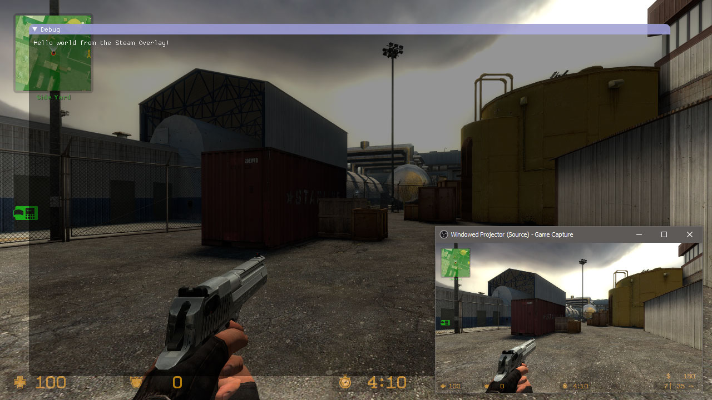

# gameoverlayrenderer-imgui-dx9

Example project demonstrating [ImGui](https://github.com/ocornut/imgui) rendering via the Steam in-game overlay. This is specifically designed for DirectX 9 games and will require some changes to work on other graphics APIs.

See the [blog post here](https://aixxe.net/2017/09/steam-overlay-rendering) for more details.

# Usage

* Open with Visual Studio and compile.
* Load into a DirectX 9 game using a library loader.